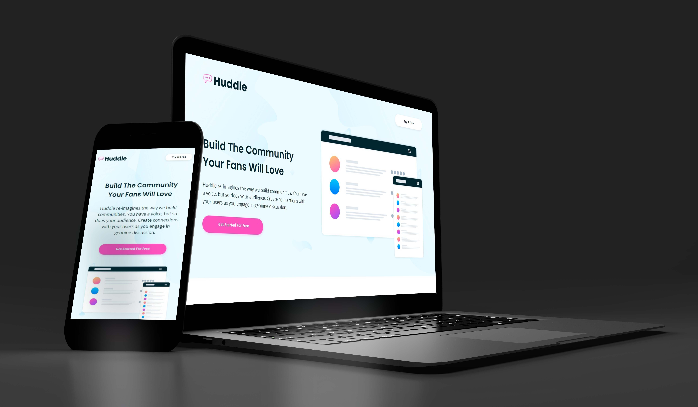

# Frontend Mentor - Huddle landing page with alternating feature blocks solution

This is a solution to the [Huddle landing page with alternating feature blocks challenge on Frontend Mentor](https://www.frontendmentor.io/challenges/huddle-landing-page-with-alternating-feature-blocks-5ca5f5981e82137ec91a5100). Frontend Mentor challenges help you improve your coding skills by building realistic projects.

## Table of contents

- [Overview](#overview)
    - [The challenge](#the-challenge)
    - [Screenshot](#screenshot)
    - [Links](#links)
- [My process](#my-process)
    - [Built with](#built-with)
    - [What I learned](#what-i-learned)
    - [Continued development](#continued-development)
    - [Useful resources](#useful-resources)
- [Author](#author)

## Overview

### The challenge

Users should be able to:

- View the optimal layout for the site depending on their device's screen size
- See hover states for all interactive elements on the page

### Screenshot

### Links

- Solution URL: [https://github.com/gchristofferson/huddle-landing-page-with-alternating-feature-blocks](https://github.com/gchristofferson/huddle-landing-page-with-alternating-feature-blocks)
- Live Site URL: [https://gchristofferson.github.io/huddle-landing-page-with-alternating-feature-blocks/](https://gchristofferson.github.io/huddle-landing-page-with-alternating-feature-blocks/)

## My process

### Built with

- Semantic HTML5 markup
- CSS custom properties
- Flexbox
- Mobile-first workflow
- BEM methodology

### What I learned

This challenge was pretty straight forward and gave me another opportunity to use Flexbox.  My biggest learning from this challenge actually had more to do with my workflow as I started using live templates in Webstorm IDE.  This shaved a considerable amount of time off the project as I was quickly able to populate the styles sheet with resets and other rules I use in almost every project.  I also used live-templates to quickly add links to my style sheet and font awesome library  to the head of my HTML.  I"m also learning to speed up my workflow by consistently working from the top of the document down, section by section; finishing one section completely before moving to the next.  Another thing I started doing was as I got near the end of the page I would comment out all the code at the top of the page, so that on refresh I wouldn't have to scroll the section I was working on into view every time.

### Continued development

I'm starting to feel more confident using Flexbox for layouts.  Going forward my goal is to really refine my skills so that I can speed up my workflow even more, to become not only a quality front-end developer but a highly efficient one as well.

### Useful resources

- [Webstorm Live Templates](https://www.jetbrains.com/help/webstorm/using-live-templates.html) - This documentation helped me learn how to use Webstorm's live templates to speed up my workflow.  If you use Webstorm as your IDE, I highly recommend learning to use this feature.

## Author

- Frontend Mentor - [@gchristofferson](https://www.frontendmentor.io/profile/gchristofferson)
- Twitter - [@GreggChristoff2](https://twitter.com/GreggChristoff2)
